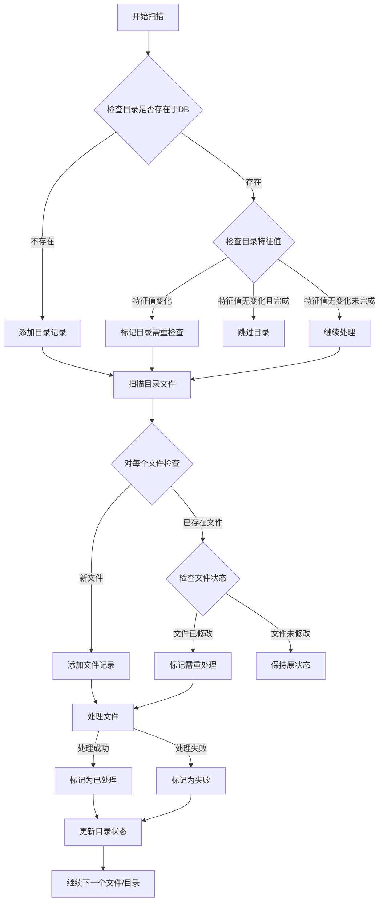
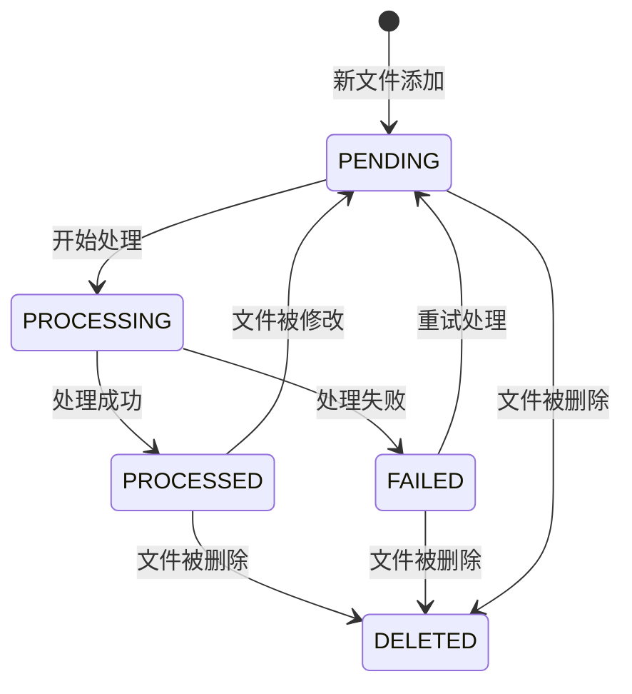
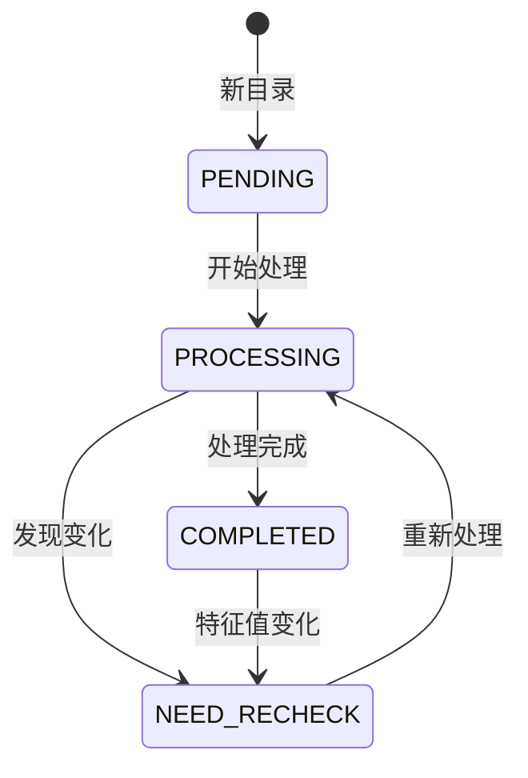
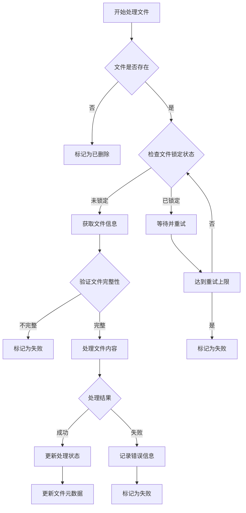

**database design**

   
    
    CREATE TABLE directories (
        path TEXT PRIMARY KEY,
        last_signature TEXT,        -- 目录的特征值
        last_check_time TIMESTAMP,  -- 最后检查时间
        last_process_time TIMESTAMP,-- 最后处理时间
        status TEXT                 -- 'PENDING', 'PROCESSING', 'COMPLETED', 'NEED_RECHECK'
    );

    CREATE TABLE files (
        path TEXT PRIMARY KEY,
        directory_path TEXT,
        file_size INTEGER,
        modified_time REAL,         -- 文件修改时间
        process_time TIMESTAMP,     -- 处理时间
        status TEXT,               -- 'PENDING', 'PROCESSED', 'FAILED'
        hash TEXT,                 -- 文件内容hash
        FOREIGN KEY (directory_path) REFERENCES directories(path)
    );

**Procedure diagram**:

***Main process***

***file status changing***

***directory changing***

***single file process***

