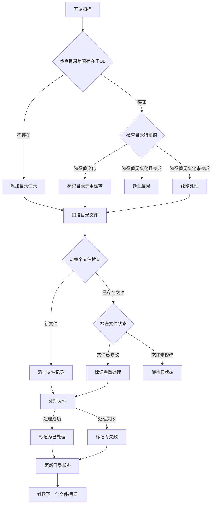
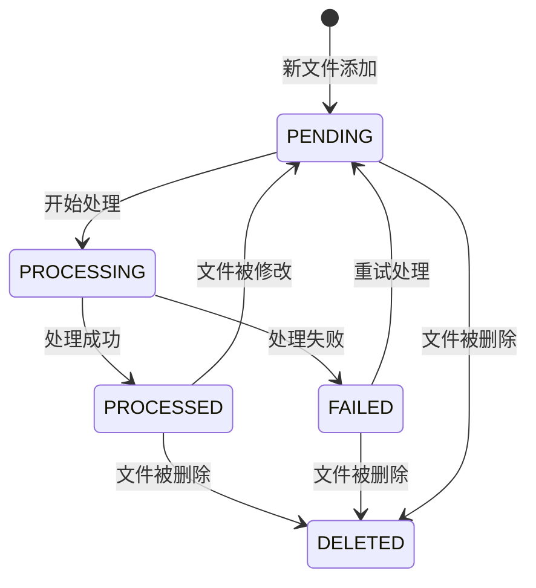
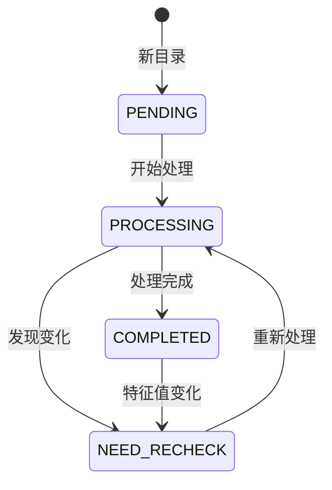
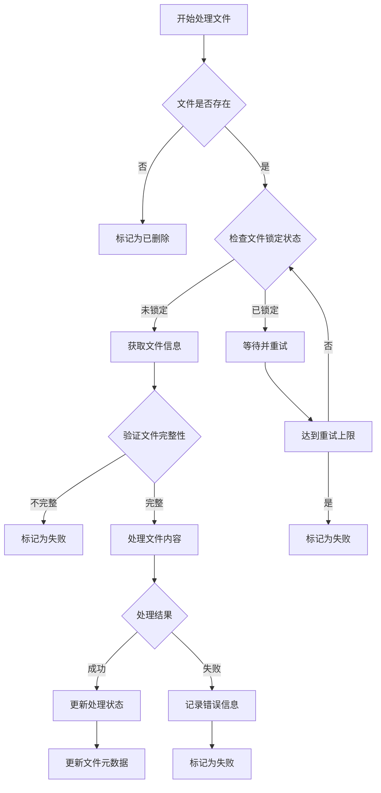

**System design for**

** purpose: 将内网公共盘上的项目文件数据化**
项目文件格式为doc,docx, xls,xlsx四种，文件名也有固定规则，一般为项目标号+00x， x为序号，譬如240400232HYN-001。如果抓取的数据，也有既定规则，譬如第1个表格，第2行，第1列的内容。每个文件需抓取的数据会有多项。需要允许在配置文件里配置每个任务的细节，每个任务会有目标文件类型，会有目标数据，每个目标数据会有抓取位置和判定有效的规则。
系统根据任务的细节去到内网公共盘里的某个路径查找到文件，抓取数据，存入数据库。
内网公共盘的路径下会有大约几万级别的文件夹，每个文件夹下又会有数个或者数十个文件夹，需要抓取的文件都在这些文件夹下面。

# ASP.NET Core API 系统实现方案

## 系统架构

本系统采用了清晰的分层架构设计，包括以下几个主要组件：

1. **Grab.Core** - 核心层，包含所有的领域模型、接口和业务逻辑
2. **Grab.Infrastructure** - 基础设施层，实现数据访问、文件操作等基础服务
3. **Grab.API** - API层，提供RESTful接口与外部系统交互

### 核心层 (Grab.Core)

核心层定义了系统的基本实体和接口，包括：

#### 实体模型
- `Directory` - 表示需要扫描的目录
- `FileItem` - 表示需要处理的文件
- `Task` - 表示数据抓取任务
- `DataExtractRule` - 表示数据抓取规则
- `ExtractedData` - 表示抓取的数据

#### 核心接口
- `IDirectoryRepository` - 目录数据访问接口
- `IFileRepository` - 文件数据访问接口
- `ITaskRepository` - 任务数据访问接口
- `IExtractedDataRepository` - 抓取数据访问接口
- `IScanService` - 扫描服务接口
- `IDocumentProcessorService` - 文档处理服务接口
- `ITaskService` - 任务管理服务接口

### 基础设施层 (Grab.Infrastructure)

基础设施层实现了核心层定义的接口，包括：

#### 数据访问
- `GrabDbContext` - 数据库上下文，使用EF Core实现
- `DirectoryRepository` - 目录仓储实现
- `FileRepository` - 文件仓储实现
- `TaskRepository` - 任务仓储实现
- `ExtractedDataRepository` - 抓取数据仓储实现

#### 服务实现
- `ScanService` - 实现目录和文件的扫描和处理逻辑
- `DocumentProcessorService` - 实现文档数据的提取和验证
- `TaskService` - 实现任务的管理和配置

### API层 (Grab.API)

API层提供了RESTful接口，包括：

- `TaskController` - 任务管理API
- `ScanController` - 扫描和处理API
- `DataController` - 数据查询API

## 数据流程

系统处理数据的主要流程如下：

1. **扫描阶段**
   - 系统从配置的根路径开始扫描
   - 对每个目录计算特征值，判断是否有变化
   - 对有变化的目录，扫描其中的文件

2. **文件处理阶段**
   - 系统对每个文件计算哈希值，判断是否有变化
   - 对新文件或有变化的文件，根据任务配置进行处理
   - 处理前检查文件是否锁定，避免冲突

3. **数据提取阶段**
   - 根据文件类型选择合适的处理器
   - 根据配置的提取规则从文档中提取数据
   - 对提取的数据进行验证

4. **数据存储阶段**
   - 将验证通过的数据存入数据库
   - 更新文件和目录的处理状态

## 优化策略

为了处理大量文件和目录，系统采用了以下优化策略：

1. **增量处理**
   - 使用特征值和哈希值对比，只处理有变化的内容
   - 维护目录和文件的处理状态，避免重复工作

2. **并行处理**
   - 采用任务并行模式，同时处理多个文件
   - 使用线程池限制并发数，避免资源耗尽

3. **错误恢复**
   - 记录处理失败的文件，支持重试机制
   - 使用事务保证数据一致性

## 技术实现

系统使用了以下技术和框架：

- **ASP.NET Core 6.0** - Web API框架
- **Entity Framework Core** - ORM框架，使用SQLite数据库
- **DocumentFormat.OpenXml** - 处理Office文档
- **依赖注入** - 实现松耦合的组件设计
- **异步编程** - 提高系统响应性

## 配置系统

系统支持灵活的任务配置，包括：

- **文件类型配置** - 支持doc、docx、xls、xlsx等多种文件类型
- **数据提取规则** - 可配置数据在文档中的位置（表格、行、列等）
- **数据验证规则** - 可配置正则表达式或其他验证规则

该数据库和流程设计已经过优化，具有高效性、准确性和灵活性，能够满足从内网公共盘提取文件数据的需求。

**database design**

   
    
    CREATE TABLE directories (
        path TEXT PRIMARY KEY,
        last_signature TEXT,        -- 目录的特征值
        last_check_time TIMESTAMP,  -- 最后检查时间
        last_process_time TIMESTAMP,-- 最后处理时间
        status TEXT                 -- 'PENDING', 'PROCESSING', 'COMPLETED', 'NEED_RECHECK'
    );

    CREATE TABLE files (
        path TEXT PRIMARY KEY,
        directory_path TEXT,
        file_size INTEGER,
        modified_time REAL,         -- 文件修改时间
        process_time TIMESTAMP,     -- 处理时间
        status TEXT,               -- 'PENDING', 'PROCESSED', 'FAILED'
        hash TEXT,                 -- 文件内容hash
        FOREIGN KEY (directory_path) REFERENCES directories(path)
    );

**Procedure diagram**:

***Main process***

***file status changing***

***directory changing***

***single file process***

